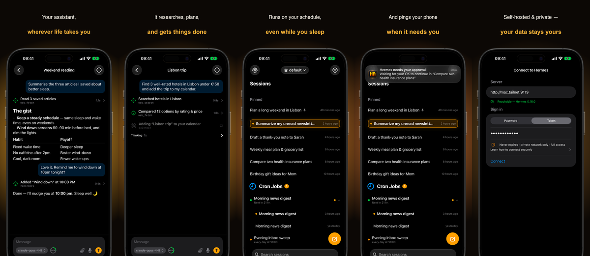

<div align="center">


# Hermes Agent Mobile Companion

**Drive your self-hosted Hermes agent from your iPhone.**

Chat with sessions, watch the agent work in real time, and approve or clarify its
actions — all from your pocket, while the real runtime stays on your Mac or server.


<br/>

Native SwiftUI · [The Composable Architecture](https://github.com/pointfreeco/swift-composable-architecture) · no agent logic on the phone

</div>

## What it does

Hermes Mobile is a thin remote client for a self-hosted
**[Hermes Agent](https://github.com/NousResearch/hermes-agent)**. The agent
keeps running on your machine; the phone is a window into it — so you can step away
from your desk and still keep your agent moving.

- **Connect once.** Enter your server URL and token; the token lives in the iOS
  Keychain and the app auto-logs-in on launch.
- **Find any session.** Browse sessions grouped by workspace, search across all of
  them, pin the ones you care about, rename or archive them, and resume or start a
  new one.
- **Switch profiles.** Keep multiple Hermes profiles on one agent and switch between
  them from a Safari-style header pill — each profile has its own scoped session list,
  and new chats are created under the selected one. Create custom profiles (with an
  optional SOUL.md) right from the app.
- **Watch it work.** Streaming responses render as native Markdown, with tool/skill
  activity rows (tap for args, results, and diffs), a live "Thinking" indicator with an
  elapsed timer that collapses into a reviewable reasoning + status disclosure when the
  turn ends, and a subtle glow on sessions that are actively running.
- **Compose hands-free or with files.** Dictate a message with voice input (a live
  waveform while recording; transcribed by your agent), and attach photos, camera
  captures, PDFs, or any file straight from the composer.
- **See how full the context is.** A color-coded pill in the composer shows
  used/max tokens and percent (mirroring the Hermes TUI thresholds); tap it for a
  breakdown of input/output split, compactions, and estimated cost.
- **Copy what you need.** Copy a whole message, or just a single code block with a
  one-tap button and a green-check confirmation.
- **Approve from anywhere.** The mobile-native payoff: respond to approval, clarify,
  and `sudo`/`secret` prompts the moment they arrive.
- **Stays connected.** Automatic reconnect with backoff and a clear connection banner
  when the link drops.

## Quick start

You'll need macOS with **Xcode 26+**, **Tuist** (`brew install tuist`), and a running
Hermes Agent reachable from your Mac.

**1. Expose Hermes to your network.** On the Hermes machine, bind to all interfaces
and set a stable token. The trust boundary is your private network (e.g. Tailscale):

```sh
hermes ... --host 0.0.0.0 --insecure
export HERMES_DASHBOARD_SESSION_TOKEN=<your-stable-secret>
```

> ⚠️ `--insecure` exposes the dashboard with only token auth — do this **only** behind
> a private VPN like Tailscale, never on the open internet.

**2. Build and run the app:**

```sh
make run        # builds and launches on a simulator — no signing needed
```

**3. Connect.** Open the app, enter your server URL (e.g.
`http://<tailnet-host>:9119`) and the token from step 1. That's it — you're in.

To run on a physical device, see [`docs/development.md`](docs/development.md).

## Documentation

- [**Architecture**](docs/architecture.md) — how the app is structured, the TCA
  feature tree, dependency clients, and the wire protocol.
- [**Development**](docs/development.md) — building, running on device, testing,
  snapshots, and TestFlight distribution.

## Status

The MVP is feature-complete and shipping to TestFlight — the full loop (connect,
browse/search/resume/create, stream, approve/clarify) is built and covered by unit and
SwiftUI snapshot tests. It's a personal tool first, designed to run over a private
network.

## License

[MIT](LICENSE) © Eugene Honcharenko
